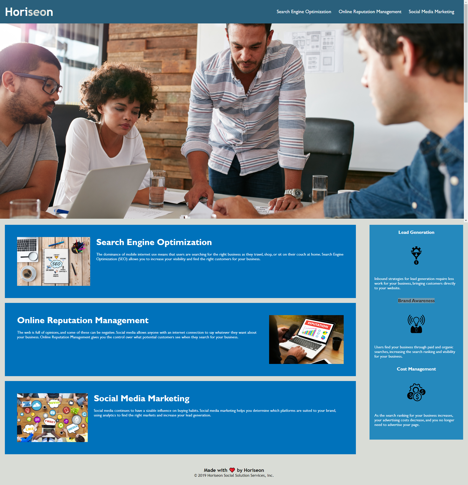

# Horiseon Project!

***

### General Info
Here is a list of what was refactored.
Fixed indentations. Added alt attribute to all img. Changed and Added semantic elements throughout html page to add better structure and understanding to page. Added a Title. Condensed class attributes in CSS to de-clutter style sheet. Added comments to both html and css. Changed structure of elements in html and css to follow flow of webpage. Fixed link to function correctly. Uploaded repository to github. Added README file.

## Screenshot

## Link to Deployed Application

(https://brian-nelson10.github.io/horiseonproject/ "Horiseon Homepage")

